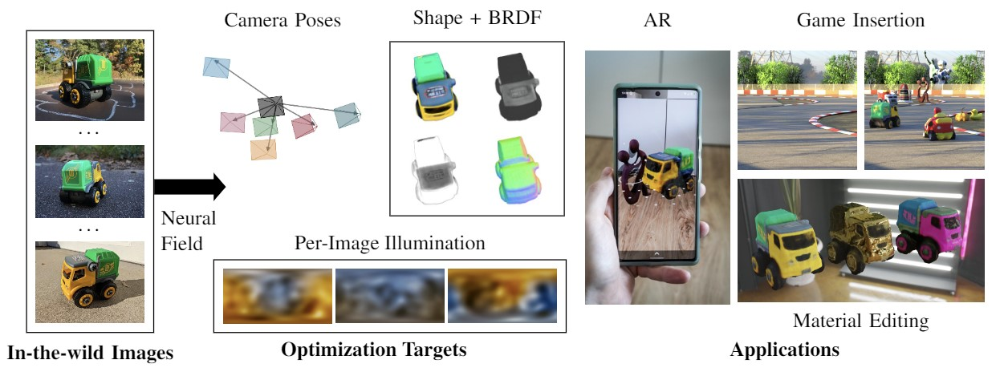

This is not an officially supported Google product.

# SAMURAI: Shape And Material from Unconstrained Real-world Arbitrary Image collections
### [Project Page](https://markboss.me/publication/2022-samurai/) | [Video](https://youtu.be/LlYuGDjXp-8) | [Paper](https://arxiv.org/abs/2205.15768) | [Scenes](https://www.dropbox.com/sh/x3u2szvaqjtaykl/AACCZn05NciMa5bHhn60p9vja?dl=0)

Implementation for SAMURAI. A novel method which decomposes multiple coarsly posed images into shape, BRDF and illumination.
<br><br>
[SAMURAI: Shape And Material from Unconstrained Real-world Arbitrary Image collections](https://markboss.me/publication/2022-samurai/)<br>
[Mark Boss](https://markboss.me)<sup>1</sup>, [Andreas Engelhardt](https://uni-tuebingen.de/fakultaeten/mathematisch-naturwissenschaftliche-fakultaet/fachbereiche/informatik/lehrstuehle/computergrafik/lehrstuhl/mitarbeiter/andreas-engelhardt/)<sup>1</sup>, [Abhishek Kar](https://abhishekkar.info)<sup>2</sup>, [Yuanzhen Li](http://people.csail.mit.edu/yzli/)<sup>2</sup>, [Deqing Sun](https://deqings.github.io)<sup>2</sup>, [Jonathan T. Barron](https://jonbarron.info)<sup>2</sup>, [Hendrik P. A. Lensch](https://uni-tuebingen.de/en/faculties/faculty-of-science/departments/computer-science/lehrstuehle/computergrafik/computer-graphics/staff/prof-dr-ing-hendrik-lensch/)<sup>1</sup>, [Varun Jampani](https://varunjampani.github.io)<sup>2</sup><br>
<sup>1</sup>University of Tübingen, <sup>2</sup>Google Research
<br><br>



## Setup

A conda environment is used for dependency management

```
conda env create -f environment.yml
conda activate samurai
```

In case new datasets should be processed, we also provide a bash script to setup the u2net:

```
./setup_envs.sh
```

## Running

Download one of our test [scenes](https://www.dropbox.com/sh/x3u2szvaqjtaykl/AACCZn05NciMa5bHhn60p9vja?dl=0) and extract it to a folder. Then run:

```
python train_samurai.py --config configs/samurai/samurai.txt --datadir [DIR_TO_DATASET_FOLDER] --basedir [TRAIN_DIR] --expname [EXPERIMENT_NAME] --gpu [COMMA_SEPARATED_GPU_LIST]
```

## Run Your Own Data

The process of running your own data first requires a simple folder with images. Given that the environment is fully set up, the preparation is done with `prepare_dataset.sh [PATH_TO_FOLDER]`. This automatically creates the expected folder structure.

For the initial poses, we have created a GUI for labeling which can be started with `python -m dataset_quadrant_labeler`. Here, we propse to enter the image folder and start labeling. Keybindings are shown in the GUI and enable fast labeling. When all images are labeled the pose json file is automatically saved at the correct path.

## Evaluation

The [train_samurai.py](train_samurai.py) can be called with a `--render_only` flag and the `--config` flag pointing to the `args.txt` of the experiments folder.

## Mesh extraction

For the mesh extraction a [blender](https://www.blender.org) installation is required. The [extract_samurai.py](extract_samurai.py) script can be used to perform the extraction automated. Here, again the `--config` flag pointing to the `args.txt` of the experiments folder is required. Addtionally, a `--blender_path` flag pointing to the blender executable is required. The `--gpus` flag can be used to set the specific gpu for extraction and baking.

## Citation

```
@inproceedings{boss2022-samurai,
  title         = {{SAMURAI}: {S}hape {A}nd {M}aterial from {U}nconstrained {R}eal-world {A}rbitrary {I}mage collections},
  author        = {Boss, Mark and Engelhardt, Andreas and Kar, Abhishek and Li, Yuanzhen and Sun, Deqing and Barron, Jonathan T. and Lensch, Hendrik P.A. and Jampani, Varun},
  booktitle     = {Advances in Neural Information Processing Systems (NeurIPS)},
  year          = {2022},
}
```
